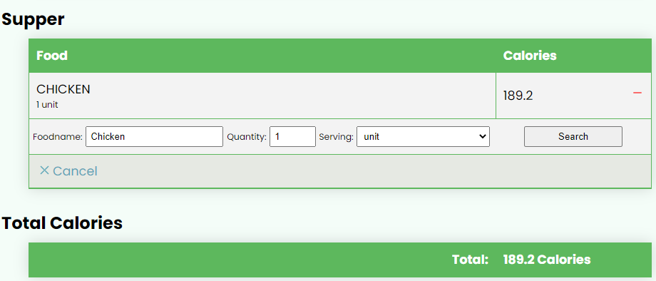

<h1>Eat Right</h1>
<p>Eat Right is a calorie counter and also has a feature for recipe viewing and submitting.</p>

----
<p> Click <a href="http://web-02.yoursamie.tech/eat_right">here </a>to enjoy the deployed app.<p>

----
<p>Get to know the developers</p>
:boy: <b>Kaleab Tesfaye</b> <br>
  &nbsp;&nbsp;&nbsp;&nbsp;&nbsp;<a href="https://twitter.com/samdre60">Twitter</a> <br>
  &nbsp;&nbsp;&nbsp;&nbsp;&nbsp;<a href="https://github.com/kalom60">Github</a> <br>
  &nbsp;&nbsp;&nbsp;&nbsp;&nbsp;<a href="https://linkedin.com/in/kaleab-tesfaye-3b0546201">Linkedin</a> <br>
:woman: <b>Samra Solomon</b> <br>
  &nbsp;&nbsp;&nbsp;&nbsp;&nbsp;<a href="https://twitter.com/Samie67514029">Twitter</a> <br>
  &nbsp;&nbsp;&nbsp;&nbsp;&nbsp;<a href="https://github.com/samie-ya">Github</a> <br>
  &nbsp;&nbsp;&nbsp;&nbsp;&nbsp;<a href="https://linkedin.com//in/samra-solomon-24b745208">Linkedin</a> <br>
:boy: <b>Tony Baidoo</b> <br>
  &nbsp;&nbsp;&nbsp;&nbsp;&nbsp;<a href="https://twitter.com/iam_tonnie">Twitter</a> <br>
  &nbsp;&nbsp;&nbsp;&nbsp;&nbsp;<a href="https://github.com/tcrz">Github</a> <br>
  &nbsp;&nbsp;&nbsp;&nbsp;&nbsp;<a href="https://linkedin.com/in/tony-baidoo-0aaab7230">Linkedin</a> <br>

----
<div align="center">

[Table Content](#table-content)&nbsp;&nbsp;&nbsp;•&nbsp;&nbsp;&nbsp;[Pre-Requisite](#pre-requisite)&nbsp;&nbsp;&nbsp;•&nbsp;&nbsp;&nbsp;[Running The App](#running-app)&nbsp;&nbsp;&nbsp;•&nbsp;&nbsp;&nbsp;[Features](#features)

</div>

----
<h2 id="table-content">Table of contents</h2>

Files | Description
----- | -----------
[dumpable.sql](./dumpable.sql) | This is the sql file that holds the statements used to create and populate the database.
[for_running_flask.txt](./for_running_flask.txt) | Inside this file you'll find the commands to run the webpage and api. You need to open two terminals, one for each to run on.
[sample_images](./sample_images) | Sample recipe images to use for recipe submission.
[sample_recipes.txt](./sample_recipes.txt) | Sample recipes to use for recipe submission.
[tables](./tables) | This folder will hold the backend portion of how the models are created and how the database runs.
[api](./api) |This folder will hold all the routes we used on the backend to make the front-end dynamic.
[web_dynamic](./web_dynamic) | This folder holds the html, css, flask templates, javascript of the webpage.
[web_static](./web_static) | This folder hold the static content of the webpage, html and css
[AUTHORS](./AUTHORS) | file contains email and the github usernames of the developers of this project.

----
<h2 id="pre-requisite">Pre-Requisite</h2>
<ul>
  <li>Python</li>
  <ol>
   <li>pip3</li>
   <li>Flask</li>
   <li>flask_cors</li>
   <li>Sqlalchemy</li>
   <li>MySQLdb</li>
  </ol>
  <li>Mysql</li>
  <ol>
   <li>Mysql Server</li>
  </ol>
</ul>

<p>For installation use the table below</p>


Packages | Installation
----- | -----------
Python3 | sudo apt-get install python3.8
pip3 | sudo apt install python3-pip
Flask | pip install Flask
MySQLdb | sudo apt-get install python3-dev
&nbsp;  | sudo apt-get install libmysqlclient-dev
&nbsp;  |  sudo apt-get install zlib1g-dev
 &nbsp; |  sudo pip3 install mysqlclient
Sqlalchemy | pip install SQLAlchemy
flask-cors | pip install Flask-Cors

---
<h2 id="running-app">Running the app</h2>

To run this app locally, you first need to clone this repo:
```shell
crz@user:~$ git clone git@github.com:tcrz/Eat_Right.git
````
Next, enter the directory of the cloned repo and do an import of the sql dump; [dumpable.sql](./dumpable.sql):
```shell
crz@user:~$ cd Eat_Right
crz@user:~/Eat_Right$ cat dumpable | sudo mysql -p
Enter password:
crz@user:~/Eat_Right$
```

This will import all necessary data, needed for the app, into mysql.

Next, open the file; [for_running_flask.txt](./for_running_flask.txt)  and run both commands  at the root of the repo (using two separate terminals) to start the app:
```shell
crz@user:~$ cd Eat_Right
crz@user:~/Eat_Right$ cat for_running_flask.txt
for running API

user=eat_right_devs password=eat_right_dev_pwd host=localhost database=eat_right_db api_host=0.0.0.0 port=5001 python3 -m api.v1.app

for running webpage

user=eat_right_devs password=eat_right_dev_pwd host=localhost database=eat_right_db python3 -m web_dynamic.eat_right
crz@user:~$
```
```shell
#terminal 1
crz@user:~$ user=eat_right_devs password=eat_right_dev_pwd host=localhost database=eat_right_db api_host=0.0.0.0 port=5001 python3 -m api.v1.app
 * Serving Flask app 'app' (lazy loading)
 * Environment: production
   WARNING: This is a development server. Do not use it in a production deployment.
   Use a production WSGI server instead.
 * Debug mode: on
 * Running on all addresses (0.0.0.0)
   WARNING: This is a development server. Do not use it in a production deployment.
 * Running on http://127.0.0.1:5001
....

#terminal 2
crz@user:~$ user=eat_right_devs password=eat_right_dev_pwd host=localhost database=eat_right_db python3 -m web_dynamic.eat_right
 * Serving Flask app 'eat_right' (lazy loading)
 * Environment: production
   WARNING: This is a development server. Do not use it in a production deployment.
   Use a production WSGI server instead.
 * Debug mode: on
 * Running on all addresses (0.0.0.0)
   WARNING: This is a development server. Do not use it in a production deployment.
 * Running on http://127.0.0.1:5000
 ...
```

The webpage will be served at <strong>http://127.0.0.1:5000</strong>

----
<h2 id="features">Features</h2>

<h3>Landing Page</h3>

<p>This is the landing page. On the top are links you can click on to take you to the different areas of the webpage</p>

----
<h3>Calorie Predictor</h3>


<p>Here is the calorie predictor. You will click or type in your information, such as  your age, gender and activity level and it will show you how much your calorie intake should be.</p>


<p>It gives alternative options for women who are pregnant as well.</p>
<p>Once you know how much your daily intake should be, you can go to the calorie counter section.</p>

----
<h3>Calorie Counter</h3>



<p>Here you'll put in your meals to determine how much calories you ate.</p>
<p>Example: This person had clicked on 'Add Item' and we can see that they ate Chicken for supper that is of one Unit.</p>
<p>We can also see that, chicken of one unit is 189.2 Calories.</p>
<p>What you'll do is add your breakfast, lunch, and supper meals then the counter will display how much you ate. You will then get to compare it with the amount of daily calories intake of calorie preditor. User can remove food items by clicking on the red dash on the right of each row.</p>

----
<h3>Recipe</h3>


<p>Here you will find a list of recipes people from around the world have submitted. You can even search for recipe you are looking for by searching.</p>
<p>Each card comes with image of the food, name of the food, user who submitted the food and a badge on top to tell you the category of the food. It can be Snack, Dish, Soup, Stew, Drink...etc.</p>
<p>When you click on each card a pop-op will appear to show you the ingredients and preparation of the meal</p>


<p>This section also comes with add recipe card where you can add your favorite dishes on the page. Click on the 'Plus sign' on the grey Add recipe and you'll find a submit form.</p>


<p>The Submit form has many input fields where one can fill out. There is user name, recipe name, choose image(Image of the food), category(List of categories to pick from), Ingredients(It shows you how to place ingredients), and preparation(It also show you how to add preparation section).</p>
<p>Once you fill out all the required input, you then click submit. It will then be displayed on recipe section.</p>
<p>Above we mentioned files called sample_images and sample_recipe.txt. These files have sample recipes you can try on the submit form.</p>

----
<h3>About Us</h3>


<p>This section briefly summerizes the app and the development of the app. You can read it for more details.</p>

----
<h3>Developers</h3>
<p>Here you will learn who the developers are and what they contributed to the making of the app.</p>
