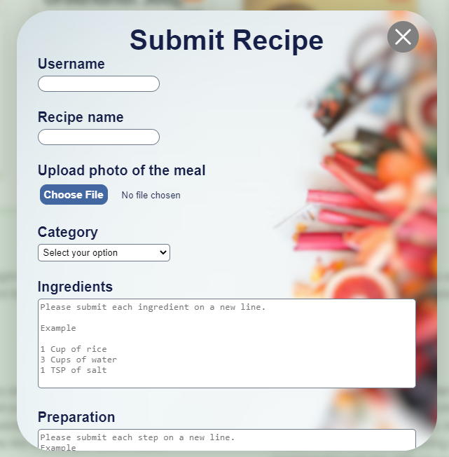

<h1>Eat Right</h1>

Eat Right is an application that is a calorie counter and also recipe viewing and submitting app.

Here we will discuss on how the app works. We will describe the step by step. So Hop on board and lets Begin.

We will first describe what the given files are when you open the Repository. 

## Table of contents
Files | Description
----- | -----------
[dumpable.sql](./dumpable.sql) | This is the sql file that holds the statements used to create and populate the database.
[for_running_flask.txt](./for_running_flask.txt) | Inside this file you'll find the commands to run the webpage and api. You need to open two terminals, one for each to run on.
[sample_images](./sample_images) | Sample recipe images to use for recipe submission
[sample_recipes.txt](./sample_recipes.txt) | Sample recipes to use for recipe submission
[tables](./tables) | This folder will hold the backend portion of how the models are created and how the database runs.
[api](./api) |This folder will hold all the routes we used on the backend to make the front-end dynamic
[web_dynamic](./web_dynamic) | This folder holds the html, css, flask templates, javascript of the webpage
[web_static](./web_static) | This folder hold the static content of the webpage, html and css
[AUTHORS](./AUTHORS) | file contains email and the github usernames of the developers of this project.

Now that we are we know how each file does, lets run and dump what we need before we begin.

<h3>Landing Page</h3>

This is the landing page. On the top are links you can click on to take you to the different areas of the webpage

<h3>Calorie Predictor</h3>

Here is the calorie predictor. You will click or type in your information, such as  your age, gender and activity level on daily bases and it will show you how much your calorie intake should be.

It gives alternative options for women who are pregnant as well.

Once you know how much your daily intake should be, you can scroll down to the calorie counter section.

<h3>Calorie Counter</h3>

Here you'll put in your meals to determine how much calories you ate.

Example: This person had clicked on 'Add Item' and we can see that they ate Chicken for supper that is of one Unit.

We can also see that, chicken of one unit is 189.2 Calories.

What you'll do is add your breakfast, lunch, and supper meals then the counter will display on total how much you ate.
You will then get to see it is the amount you should be eating on daily basis, based on the calorie preditors calculation.

Let us scroll down and explore more.

<h3>Recipe</h3>

Here you will find a list of recipes people from around the world have submitted. You can even search for recipe you are looking for on the search button.

Each card comes with image of the food, name of the food, user who submitted the food and a badge on top to tell you the category of the food. It can be Snack, Dish, Soup, Stew, Drink...etc.

When you click on each card a pop-op will appear to show you the ingredients and preparation of the meal

This section also comes with add recipe card where you can add your favorite dishes on the site. Click on the 'Plus sign' on the grey Add recipe and you'll find a submit form.

The Submit form has many input fields where one can fill out. There is user name, recipe name, choose image(Image of the food), category(List of categories to pick from), Ingredients(It shows you how to place ingredients), and preparation(It also show you how to add preparation section).

Once you fill out all the required input you then click submit. It will then be displayed on recipe section.

Above we mentioned files called sample_images and sample_recipe.txt. These files have sample recipes you can try on the submit form.

Let us scroll down.

<h3>About Us</h3>

This section briefly summerizes the app and the development of the app. You can read it for more details.

Let us scroll down.

<h3>Developers</h3>

Here you will learn who the developers are and what they contributed to the making of the app.

